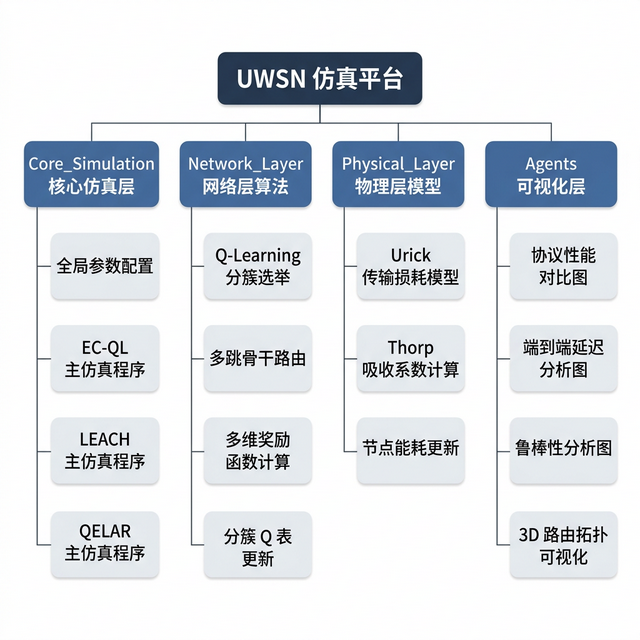
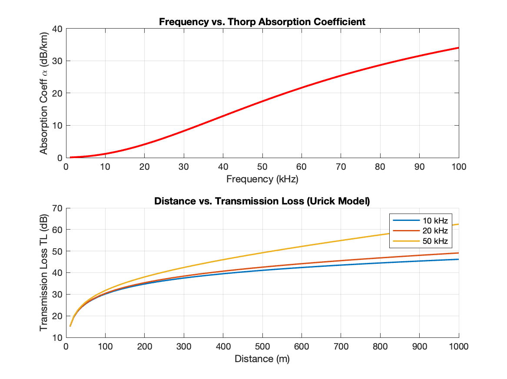
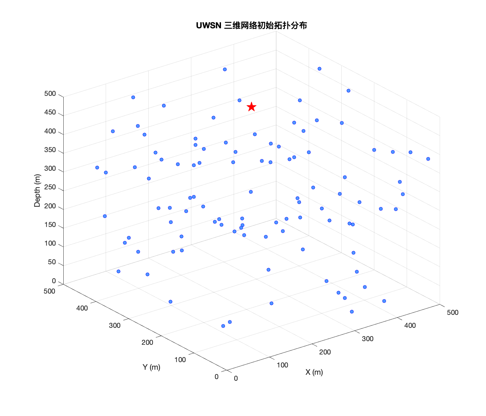
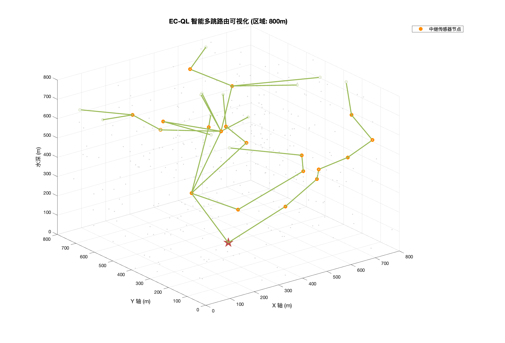
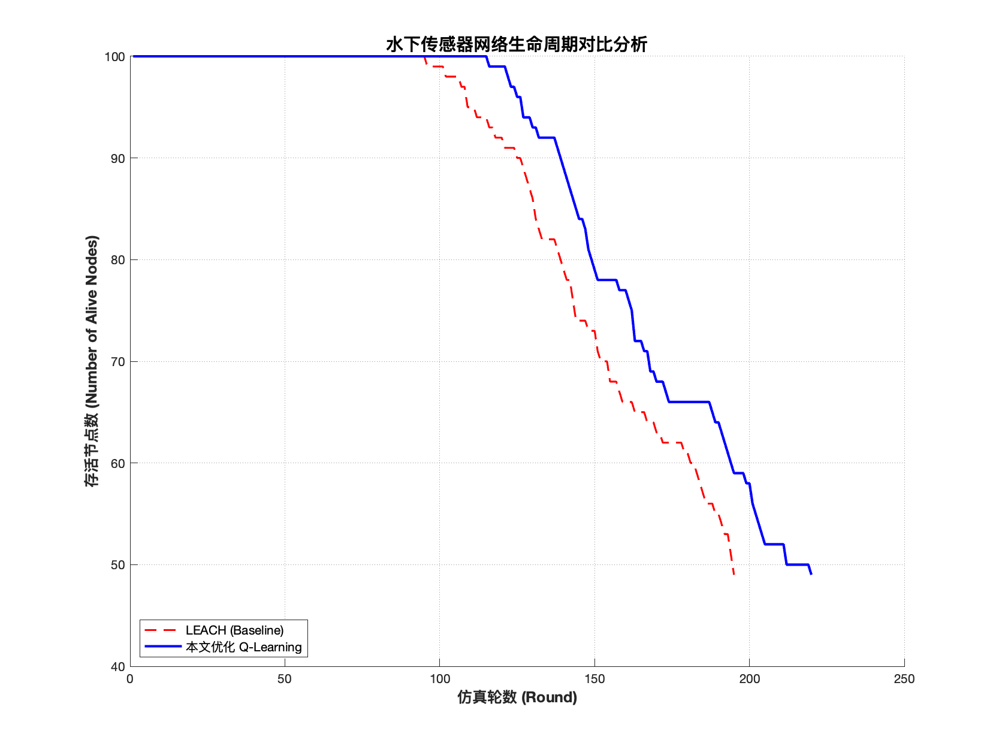
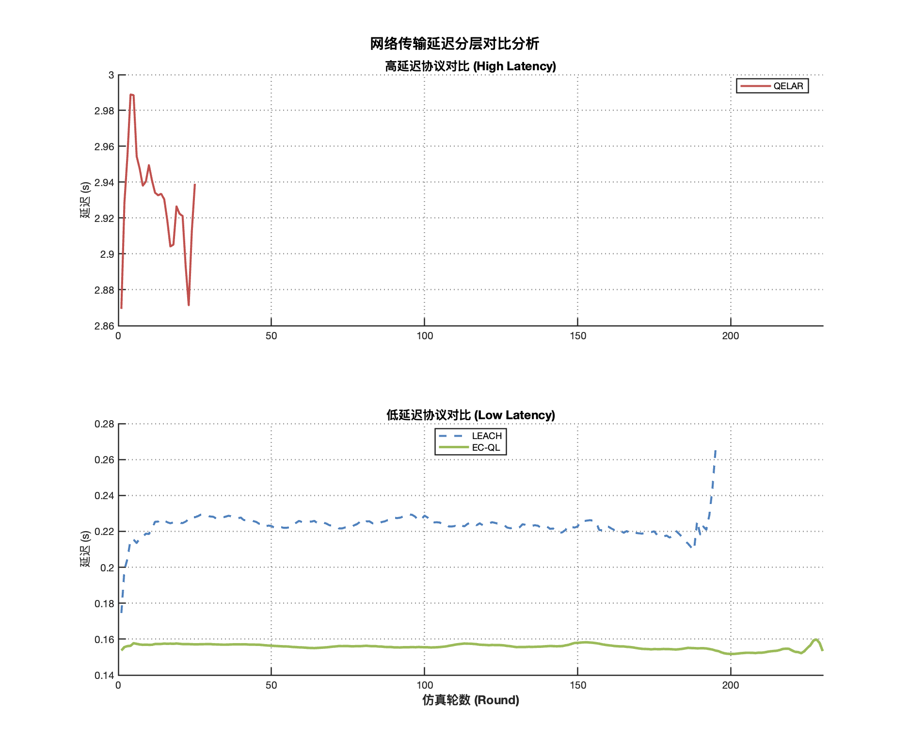
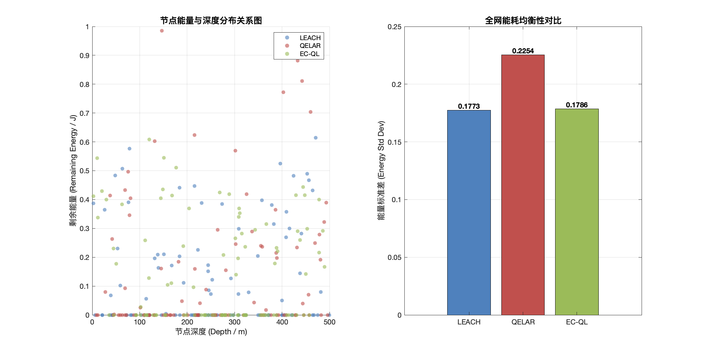

# 水下无线传感器网络节能路由协议研究

## 中期报告

---

## 一、进度介绍

### 1.1 理论工作

在课题研究的理论准备阶段，研究首先围绕水下无线传感器网络（UWSN）的节能路由问题展开了系统性的背景调研与文献综述，重点梳理了当前主流路由协议的设计思路，以及它们在水下环境中的适用性局限，从而明确了本研究的切入点与创新方向。
在此基础上，针对水声信道有别于地面无线信道独特的物理特性，研究完成了水声信道传播模型的理论分析与建模工作；在协议设计层面，研究完成了算法 EC-QL 的整体框架设计。
研究还完成了多维度奖励函数的理论设计，使EC-QL算法在网络全生命周期内实现节能与低延迟的协同优化。同时，研究选用了两种对比协议 LEACH 与 QELAR，对它们的工作原理进行了深入梳理，明确了各自在分簇策略、路由决策、奖励建模等方面的设计差异，为后续仿真对比实验的指标选取与结果解读奠定了理论基础。

### 1.2 仿真工作

在理论设计完成之后，研究随即展开了系统性的仿真实现工作。
首先，以 MATLAB 为开发环境，按照模块化设计原则搭建了完整的 UWSN 仿真平台。在此平台的基础上，研究先后完成了三种路由协议的完整仿真实现——基准对照协议 LEACH 与 QELAR，以及本文提出的 EC-QL 协议——确保三者在相同网络初始条件与评价体系下运行，以保障后续对比的公平性与可复现性。
随后，针对UWSN网络的核心性能指标，研究完成了全套仿真实验并系统收集了实验数据。在实验结果的呈现层面，研究生成了多组高质量可视化图表，为后续结果分析提供了直观、充分的数据支撑。
目前，仿真工作仍有两项任务正在推进：一是对已获得的仿真数据进行深入分析与讨论，从数据中提炼出 EC-QL 相对于对比协议的显著创新点与性能优势；二是根据实验反馈，对 EC-QL 的关键超参数（包括学习率、折扣因子及 ε-greedy 探索率）进行进一步调优，以验证算法在最优参数配置下的性能表现。

---

## 二、已完成的研究工作及成果

### 2.1 研究背景与问题定义

#### 2.1.1 水下无线传感器网络（UWSN）的应用场景与挑战

水下无线传感器网络（Underwater Wireless Sensor Network, UWSN）是由大量具备感知、计算与通信能力的传感器节点构成的自组织网络系统，广泛应用于海洋环境监测、水下目标探测、海底地质勘查及军事防御等领域。然而，水下环境的物理特性与地面截然不同，给网络的设计与运行带来了一系列严峻挑战。

在信道层面，水声信道是 UWSN 通信的唯一可行介质。声波在水中的传播速度仅约 1500 m/s，远低于地面无线电波的光速传播，致使节点间的端到端传播延迟显著偏高，在多跳路径下尤为突出。与此同时，水声信道的传输损耗随距离和频率的增大而急剧增加，信道的有效通信范围因此受到严格限制；在能量层面，水下节点通常依靠电池供电，且由于部署环境的特殊性，电池更换与能量补充极为困难。节点一旦能量耗尽便永久失效，网络的整体寿命因此直接依赖于各节点的能量消耗速率及其均衡程度。如何在保证数据可靠传输的前提下最大化网络能效、延长网络生命周期，是 UWSN 路由设计面临的核心问题。

#### 2.1.2 现有协议的局限性

面对上述挑战，研究者提出了多种针对无线传感器网络的路由协议，但已有方案在水下场景中均存在不同程度的局限性。从底层机制来看，地面 WSN 协议通常基于电磁波通信设计，其信道模型、延迟假设与能耗结构均与水声信道存在根本上的差异，将其直接迁移至水下环境时，路由决策逻辑与能耗建模都难以准确反映实际情况，协议性能将大幅退化。

一些专为无线传感器网络设计的经典协议，在水下环境中也会存在明显不足。LEACH 协议采用基于概率的轮换机制随机选举簇头，完全不考虑候选节点的剩余能量，导致低能量节点被频繁选为簇头，加速了节点的过早死亡；QELAR 协议虽然引入了 Q-learning 框架来优化路由决策，但其奖励函数设计相对单一，未能同时兼顾能量效率、链路传输质量与端到端延迟等多维度的目标。因此，在水声信道高延迟、高能耗的复杂约束下，协议的综合性能仍有较大提升空间。

#### 2.1.3 研究目标

针对上述问题，研究提出一种面向 UWSN 的节能分簇强化学习路由协议 EC-QL（Energy-efficient Clustering Q-Learning）。该协议以延长网络寿命为首要目标，同时兼顾网络能耗的均衡性与端到端传输延迟的可控性。
研究同样具有清晰的量化目标：
1. 和经典 LEACH 协议相比，EC-QL 能够将网络首节点死亡时间（FND）延长 15% 以上，将端到端平均传输延迟降低 20% 以上，并使网络在相同仿真周期内的总剩余能量提升 10% 以上。
2. 对于 QELAR 协议，由于其逐节点 Q-routing 机制在三维水声信道环境下收敛性相对较差，研究则重点关注 EC-QL 在传输延迟控制方面相对于 QELAR 所能实现的显著改善。

### 2.2 仿真平台架构

#### 2.2.1 平台设计原则

为了保证仿真实验的规范性与结果的可靠性，本文在搭建 UWSN 仿真平台时，遵循“模块化”与“可扩展”两项核心设计原则。
模块化原则要求将不同层次的仿真逻辑严格解耦。物理层只负责信道建模与能耗计算，对上层路由算法的实现细节一无所知；网络层专注于路由决策，可独立替换协议而无需修改底层代码；仿真控制层统一调度各轮次的执行流程，并通过统一接口调用不同协议模块，从而保证三种协议（LEACH、QELAR、EC-QL）在完全相同的环境条件下运行，确保对比实验的公平性。
可扩展原则使平台具备良好的横向拓展能力。新协议的接入只需按照既有接口规范实现对应函数，无需改动现有代码；仿真参数集中由单一配置文件管理，批量参数扫描实验可通过简单的循环，调用复用全套仿真逻辑，从而大幅降低了实验设计的复杂度。

#### 2.2.2 代码架构

仿真平台采用四层目录结构组织代码（见图 2-1），各层职责清晰分离。

1. 核心仿真层（Core_Simulation）是整个平台的调度中枢，包含全局参数配置文件以及三种协议各自的主仿真程序，主要负责初始化网络、驱动每轮仿真循环、收集性能数据并输出结果。
2. 网络层（Network_Layer）实现了协议的核心算法逻辑，涵盖基于 Q-Learning 的分簇选举、多跳骨干路由规划、多维奖励函数计算以及 Q 表的在线更新，是 EC-QL 算法创新点最为集中的模块。
3. 物理层（Physical_Layer）封装所有与水声信道相关的物理模型，包括 Urick 传输损耗计算、Thorp 吸收系数建模以及节点能耗更新，为上层算法提供统一的物理参数接口。
4. 可视化层（Agents）是平台的输出端，负责读取仿真产生的数据文件并生成各类学术图表，包括协议性能对比图、端到端延迟分析图、鲁棒性分析图及三维路由拓扑可视化，使仿真结果可以直观呈现。

### 2.3 物理层水声信道模型与仿真实验设计

#### 2.3.1 Urick 传输损耗模型

水声信道的传输损耗（Transmission Loss, TL）是影响 UWSN 通信能耗与可靠性的首要因素。仿真中采用 Urick 经典模型对其进行建模，该模型将 TL 分解为几何扩散损耗与频率相关吸收损耗两部分，其表达式为：

$$TL(d,\, f) = k \cdot 10\log_{10}(d) + \alpha(f) \cdot d \times 10^{-3}$$

其中，$d$ 为发送节点与接收节点之间的欧氏距离（单位：m），$\alpha(f)$ 为与频率相关的吸收系数（单位：dB/km），$k$ 为扩散传播系数。扩散系数 $k$ 的取值反映了声波的几何传播方式：球面扩散时 $k=2$，柱面扩散时 $k=1$，而实际海洋环境介于二者之间，仿真中取 $k=1.5$， 以更贴近真实的复杂水声环境。

#### 2.3.2 Thorp 吸收系数模型

吸收系数 $\alpha(f)$ 由 Thorp 经验公式给出，该公式综合考虑了硼酸弛豫、硫酸镁弛豫及纯水粘滞吸收三种机制的贡献：

$$\alpha(f) = \frac{0.11 f^2}{1 + f^2} + \frac{44 f^2}{4100 + f^2} + 2.75 \times 10^{-4} f^2 + 0.003$$

其中频率 $f$ 的单位为 kHz，$\alpha(f)$ 的单位为 dB/km。由公式可知，吸收系数随频率升高而显著增大，这意味着水声系统必须在偏低频率下工作以控制传输损耗，所以，仿真采用 25 kHz 作为通信频率。

#### 2.3.3 能耗模型

节点的通信能耗由发送能耗、接收能耗与空闲功耗三部分组成。发送一个长度为 $L$（bits）的数据包，节点的发送能耗为：

$$E_{tx}(L,\, d) = L \cdot E_{elec} + P_{amp} \cdot d^2 \cdot \frac{L}{R}$$

其中 $E_{elec}$ 为电路能耗系数（50 nJ/bit），$P_{amp}$ 为功率放大器系数（10 pW/bit/m²），$R$ 为数据传输速率（10 kbps）。第一项代表固定的电路能耗，第二项反映随距离平方增长的传播能耗，体现了缩短跳距在能量控制上的重要价值。接收端的能耗为 $E_{rx} = L \cdot E_{elec}$，仅包含电路能耗。此外，节点在空闲监听状态下每轮消耗的能量为 $E_{idle} = P_{idle} \cdot T_{round}$，其中空闲功耗 $P_{idle} = 1$ mW，每轮时长 $T_{round} = 3$ s。

#### 2.3.4 信道模型验证

图 2-2 展示了上述物理层模型的可视化结果，用于验证模型实现的正确性。

图的上半部分呈现了 Thorp 吸收系数随频率变化的曲线。可以观察到，吸收系数在较低频率（< 10 kHz）时数值相对平稳，而随频率升高急剧增大，在 100 kHz 以上时吸收损耗已相当显著。这一特性决定了水声通信系统必须工作在较低频段。图的下半部分则展示了在不同频率下，传输损耗 TL 随通信距离增加的变化曲线。从图中可清晰看出，无论何种频率，TL 均随距离增大而单调递增；在相同距离下，频率越高则损耗越大，两者的差异随距离拉大而更加显著。上述结果与理论分析完全吻合，证明了本文物理层模型实现的正确性。

#### 2.3.5 仿真实验参数设置

本文各项仿真实验均采用如下统一参数配置：
（表格）
| 参数类别 | 参数名称 | 取值 |
|:---:|:---|:---:|
| **网络拓扑** | 节点总数 | 100 |
| | 网络区域 | 500 × 500 × 500 m³ |
| | Sink 位置 | (250, 250, 500) m |
| | 通信半径 | 325 m |
| | 节点初始能量 | 1.0 J |
| **通信参数** | 数据包长度 | 2048 bits |
| | 传输速率 | 10 kbps |
| | 通信频率 | 25 kHz |
| | 电路能耗系数 $E_{elec}$ | 50 nJ/bit |
| | 功放系数 $P_{amp}$ | 10 pW/bit/m² |
| **仿真控制** | 最大仿真轮次 | 2000 轮 |
| | 每轮时长 | 3 s |
| | 每节点每轮数据包数 | 10 |
| **Q-learning** | 学习率 $\alpha$ | 0.1 |
| | 折扣因子 $\gamma$ | 0.9 |
| | 探索率 $\epsilon$ | 0.2 |
| | 奖励权重 $\alpha_{val}$ / $\beta_{val}$ / $\gamma_{val}$ | 0.4 / 0.4 / 0.2 |

#### 2.3.6 评价指标定义

为了全面衡量各路由协议的综合性能，本文选取以下四类核心评价指标：
1. 网络寿命：以首节点死亡轮次（First Node Dead, FND）量化，即网络中第一个节点能量耗尽时所对应的仿真轮次，FND 越大表示网络寿命越长。
2. 总剩余能量：记录每轮结束后全网所有存活节点的能量之和，反映协议在不同阶段的整体能效。曲线下降越缓慢，说明能量利用效率越高。
3. 端到端传输延迟：定义为数据包从源节点出发、经由中间节点转发直至到达 Sink 的累计传播时延，主要由各跳的水声传播延迟叠加而成，直接体现了协议对路径长度与跳数的控制能力。
4. 鲁棒性指标：通过系统性地改变外部条件（业务负载、网络覆盖区域、节点初始能量异构度），观察 FND 的变化幅度，量化协议在非标准场景下的适应能力与稳定性。

### 2.4 对比协议实现

为保障仿真对比实验的公平性，研究在仿真平台 MATLAB 上完整复现了 LEACH 与 QELAR 两种基准协议，并在与 EC-QL 完全相同的网络初始条件与参数配置下运行。

#### 2.4.1 LEACH 协议实现

LEACH（Low-Energy Adaptive Clustering Hierarchy）是无线传感器网络中最具代表性的分簇路由协议之一。其核心思想是通过周期性地随机轮换簇头角色，将能量消耗均摊至全网所有节点，从而避免固定簇头因负担过重而过早失效。

在分簇选举阶段，每个存活节点在每轮开始时独立生成一个 $[0, 1)$ 之间的随机数，并与动态计算的阈值 $T(n)$ 比较。若随机数小于阈值，则该节点宣布成为本轮的簇头（Cluster Head, CH）。阈值的计算公式为：

$$T(n) = \frac{P}{1 - P \cdot \left[ (r - 1) \bmod \left\lfloor \frac{1}{P} \right\rfloor \right]}$$

其中 $P$ 为期望的簇头比例（取 $P = 0.05$，即每轮约 5% 的节点成为簇头），$r$ 为当前仿真轮次。这一公式保证在每个完整周期（$\lfloor 1/P \rfloor = 20$ 轮）内，每个节点恰好有一次机会成为簇头，实现轮换均衡的目的。

在关联阶段，普通成员节点根据与各簇头的欧氏距离，选择距离最近的簇头加入该簇，并将数据传送至该簇头。在路由阶段，所有簇头汇聚本簇成员的数据后，直接以单跳方式传输至 Sink 节点，不经过任何中继。

LEACH 的优势在于实现简单、轮换机制清晰；然而其主要缺陷也由此而来：阈值计算完全基于概率，不感知节点当前的实际剩余能量，这意味着能量已严重不足的节点依然有可能被选为簇头，加速了个别节点的死亡，导致全网能耗分布不均衡。此外，单跳直连 Sink 的路由策略在大规模三维 UWSN 中将产生极高的传输能耗，严重制约网络寿命。

#### 2.4.2 QELAR 协议实现

QELAR（Q-learning-based Energy-aware Routing）是一种将强化学习引入水声传感器网络路由决策的协议。与 LEACH 的分簇架构不同，QELAR 不进行显式的分簇，而是让每个存活节点各自独立地为自己的数据包寻找一条通往 Sink 的多跳路径。

在路由决策上，每个节点维护一张 Q 表，记录从本节点出发、选择各邻居节点作为下一跳时的长期预期收益 $Q(s, a)$，其中状态 $s$ 为当前节点，动作 $a$ 为候选下一跳。路由时采用 $\varepsilon$-贪心策略：以概率 $\varepsilon$ 随机探索邻居节点，以概率 $1-\varepsilon$ 选取 Q 值最大的邻居作为下一跳，平衡了探索与利用之间的关系。

QELAR 的奖励函数设计相对单一，仅以下一跳节点的剩余能量比率作为即时奖励：

$$r(s, a) = \frac{E_{next}}{E_{init}}$$

其中 $E_{next}$ 为下一跳节点的当前剩余能量，$E_{init}$ 为节点初始能量。Q 表依照标准 Bellman 方程进行在线更新：

$$Q(s, a) \leftarrow Q(s, a) + \alpha \left[ r(s, a) + \gamma \max_{a'} Q(a, a') - Q(s, a) \right]$$

其中学习率 $\alpha = 0.1$，折扣因子 $\gamma = 0.9$。数据包通过逐跳转发的方式从源节点向 Sink 前进，每到达一个中间节点便执行一次 Q 值更新，直至抵达 Sink 或超过最大跳数限制。

QELAR 的核心不足体现在两个方面：其一，奖励函数维度单一，仅考虑能量因素，忽视了水声信道特有的传播延迟问题，导致协议在延迟控制上表现较差；其二，每个节点均独立进行逐跳路由，缺乏全局分簇视角下的负载均衡机制，在网络规模较大时路径选择的收敛性和稳定性也相对较弱。

### 2.5 本文算法 EC-QL 设计与实现

#### 2.5.1 算法整体框架

EC-QL 的核心架构由两个相互独立、顺序执行的 Q-learning 层次构成，分别负责分簇决策与骨干路由优化。每个仿真轮次开始后，分簇决策层首先运行。网络中每个存活节点根据自身当前能量状态，通过 Q 表查询独立决策是否担任本轮的簇头（Cluster Head, CH），随后成员节点就近关联到最近的簇头，完成分簇结构的动态构建。分簇完成后，骨干路由层接管。各簇头作为数据汇聚点，沿着经 Q-learning 优化的多跳路径将数据逐跳转发至 Sink。两层 Q-learning 共享 $\varepsilon$-greedy 的探索策略，学习率 $\alpha = 0.1$，折扣因子 $\gamma = 0.9$，探索率从初始值 $\varepsilon_0 = 0.2$ 随轮次指数衰减，以保证算法在后期充分利用已经学到的路由知识。

这一两层解耦设计的优势在于，分簇层的决策粒度是全局性的，而路由层的决策粒度是局部性的，两者互不干扰，可以分别以不同的优化目标独立收敛，使算法整体具备更强的灵活性与可扩展性。

#### 2.5.2 基于 Q-Learning 的分簇选举

在分簇决策层，每个节点被建模为一个独立的强化学习智能体，其状态空间定义为节点当前剩余能量的离散化表示。具体而言，就是将节点的能量比率 $E_i / E_{max}$ 均匀划分为 18 个区间，节点所处的状态索引为：

$$s_i = \text{clip}\!\left(\left\lceil \frac{E_i}{E_{max}} \times 17 \right\rceil + 1,\ 1,\ 18\right)$$

动作空间仅包含两个选项：$a=1$（担任簇头 CH）或 $a=2$（作为成员 Member）。每个节点在每轮开始时以 $\varepsilon$-greedy 策略查询分簇 Q 表，选择当前状态下 Q 值更高的角色。

在关联阶段，每个成员节点计算其到所有簇头的欧氏距离，选择距离最近的簇头加入该簇，并在本轮内将数据传送至该簇头，由簇头统一进行骨干路由。图 2-3 展示了 100 个节点在 500 × 500 × 500 m³ 三维空间中的初始随机化部署拓扑，使节点位置分布具有均匀性与代表性。

图 2-4 展示了典型仿真轮次下 EC-QL 的路由拓扑结构。图中高亮显示了本轮由 Q 表选举产生的簇头节点及其在三维空间中的分布，以及簇头之间经多维度奖励函数引导的多跳骨干路径。可以观察到，EC-QL 倾向于选取能量相对充足且位置居中的节点担任簇头，并通过多跳中继逐步将数据向 Sink 方向传递，避免了 LEACH 单跳直传带来的远距离高能耗问题。

#### 2.5.3 多维度奖励函数设计

奖励函数是 EC-QL 骨干路由层的核心创新所在。有别于 QELAR 仅以节点剩余能量作为单一奖励信号，EC-QL 将路由决策的优化目标分解成五个相互补充的维度，共同构成综合奖励信号 $R_{total}$，引导路由选择在能量效率、传输进度、链路质量与传输延迟之间协同优化。

1. 能量奖励 $R_E$ 衡量下一跳节点的能量健康程度：

$$R_E = \left(\frac{E_{next}}{E_{init}}\right)^4$$

之所以采用四次方非线性设计，是因为线性比率对低能量节点的惩罚不够强烈，而四次方在 $E_{next}/E_{init}$ 趋近于零时使 $R_E$ 迅速趋向零，从而强力抑制将快耗尽节点作为中继的决策，大幅降低节点提前死亡的概率。

2. 进度奖励 $R_D$ 保证路由始终向 Sink 方向推进：

$$R_D = \frac{d_{curr}^{Sink} - d_{next}^{Sink}}{d_{curr}^{Sink}}$$

如果下一跳节点比当前节点更远离 Sink（即 $R_D \leq 0$），就给予极大负惩罚，并立即终止本跳计算，防止路由兜圈或倒退。

3. 链路质量奖励 $R_L$ 基于 Urick 传输损耗模型评估本次通信链路的信噪比：

$$R_L = \frac{\text{SNR}_{link}}{\text{SNR}_{ref}}, \quad \text{SNR}_{link} = P_{tx} - TL(d_{link},\, f) - N_{floor}$$

该维度使路由优先选择信道质量良好的短距离链路，减少因信道衰减而导致的重传开销。

4. 传播延迟奖励 $R_{Delay}$ 将水声传播时延纳入优化目标：

$$R_{Delay} = \frac{\tau_{max} - \tau_{hop}}{\tau_{max}}, \quad \tau_{hop} = \frac{d_{link}}{v_{sound}}$$

其中 $v_{sound} = 1500$ m/s 为水中声速，$\tau_{max}$ 为当前通信半径对应的最大单跳延迟。$R_{Delay}$ 越大说明本跳传播延迟越小，协议由此在路由决策层面主动抑制长跳距选择，从源头控制端到端延迟的累积。

5. 非线性距离惩罚 $R_{cost}$ 对高能耗的长距离跳跃施加额外约束：

$$R_{cost} = -20 \cdot \left(\frac{d_{link}}{d_{max}}\right)^4 - 10 \cdot \frac{E_{tx}(d_{link})}{E_{init}}$$

四次方归一化形式使惩罚在 $d_{link}$ 接近通信上限时急剧增大，从而在物理允许范围内强力抑制极端长跳，引导路由选择距离适中的高质量中继节点。

6. 能量权重 $w_E$ 随节点剩余能量的消耗而自适应增大：

$$w_E(t) = \min\!\left(0.95,\ \alpha_0 + 0.6 \cdot \left(1 - \frac{E_{curr}}{E_{init}}\right)\right)$$

其中 $\alpha_0 = 0.4$ 为初始能量权重。剩余权重 $w_{rem} = 1 - w_E$ 按 4:3:3 的比例分配给进度、链路质量与延迟三个维度。
最终，综合奖励的计算式为：

$$R_{total} = w_E \cdot R_E + 15 w_p \cdot R_D + w_l \cdot R_L + 10 w_d \cdot R_{Delay} + R_{cost}$$

其中系数 15 与 10 分别用于放大进度与延迟分量的影响尺度，使其与能量奖励在数值量级上保持可比性。这一动态调整机制的物理意义在于，网络生命早期，节点能量充裕，协议可以更多地权衡进度与链路质量；随着轮次推进、节点能量消耗加剧，协议自动收紧对能量的保护力度，使整个网络以更均衡的态势走向生命终点，而非少数节点迅速耗尽后全局性能骤降。

#### 2.5.4 骨干路由逻辑

在每轮分簇完成后，各簇头节点依次执行骨干路由：从当前簇头出发，在通信半径内筛选出所有同样处于 CH 角色、且距 Sink 更近的节点作为候选中继；若存在候选节点，则以 $\varepsilon$-greedy 策略从路由 Q 表中选取综合奖励最优的下一跳；若不存在满足条件的中继节点，但当前簇头在 Sink 通信范围内，则直接传输至 Sink 完成本跳路由。

路由 Q 表的更新采用标准 Bellman 方程的加权移动平均形式：

$$Q(s, a) \leftarrow (1-\alpha)\, Q(s, a) + \alpha \left[R_{total}(s, a) + \gamma \max_{a'} Q(a, a')\right]$$

其中 $\alpha = 0.1$，$\gamma = 0.9$。若某次传输因接收节点已死亡而失败，则对应的 Q 值被直接置为 $-100$，相当于对不可达路径施加永久性惩罚，促使后续决策主动规避该路径。多轮次的迭代更新使 Q 表逐渐收敛，路由决策也随之从初期的探索性的随机选择，演化为稳定的多维度最优策略。

### 2.6 仿真结果与分析

#### 2.6.1 核心性能对比：网络寿命与总剩余能量

图 2-5 展示了三种协议在相同仿真条件下存活节点数随轮次的变化曲线。从 FND 指标来看，EC-QL 的首节点死亡轮次为第 117 轮，LEACH 为第 96 轮，EC-QL 相比 LEACH 将网络寿命延长了约 21.9%。QELAR 由于其逐节点逐跳路由方式在所采用的三维水声信道与仿真参数设置下收敛过程不稳定，FND 极低，网络寿命显著弱于另外两种协议。

EC-QL 延长网络寿命的根本原因可从两个层面解释。在分簇层面，EC-QL 基于节点实际剩余能量的离散化状态做出角色决策，能量充裕的节点在 Q 表收敛的引导下更倾向于担任簇头，而能量不足的节点则退为成员，从源头避免 LEACH 概率盲选下低能量节点被迫担任簇头的问题。在路由层面，EC-QL 通过多跳路径规划将数据从簇头分阶段转发至 Sink，相比 LEACH 的单跳直连大幅降低了单次发送所需的能耗（发送能耗正比于 $d^2$），使全网节点的能量消耗更加均匀。仿真结束时，EC-QL 的网络总剩余能量为 14.98 J，比 LEACH（13.29 J）高出约 12.7%，印证了其在整体能效上的显著优势。

#### 2.6.2 端到端延迟分析

图 2-6 以双子图形式呈现了三协议的端到端传输延迟分布。上子图显示 QELAR 的平均端到端延迟高达约 2.93 s，远远高于另外两种协议；下子图对比了 LEACH（平均约 0.22 s）与 EC-QL（平均约 0.16 s）的延迟曲线。两者同属低延迟组，但 EC-QL 进一步将延迟降低了约 30.7%。

QELAR 高延迟的原因在于它的路由机制：每个节点独立逐跳寻路，不受"向前推进"的方向约束，路径中频繁出现绕路或跳数过多的情形，加上水声信道固有的较长传播延迟，导致端到端累积时延极高。EC-QL 的低延迟性能则源于奖励函数中显式引入的传播延迟惩罚项 $R_{Delay}$——该项直接在每次路由决策时，对长距离跳跃施加负向反馈，引导骨干路径倾向于选择距离适中的中继，在多跳传输中有效抑制了单跳延迟的累积。

与 LEACH 相比，EC-QL 的延迟优势来自更智能的中继选择。LEACH 的簇头直连 Sink 虽然跳数少，但在通信距离较大时单跳延迟同样可观；EC-QL 则通过多跳短距离链路的组合，在保证传输进度的同时实现了更低的时延。

#### 2.6.3 能耗均衡性分析

图 2-7 通过节点剩余能量与节点深度的散点分布（左子图）以及仿真结束时三协议的节点剩余能量标准差（右子图）来量化各协议的能耗均衡性。从标准差数据来看，LEACH 为 0.1773 J，QELAR 为 0.2254 J，EC-QL 为 0.1786 J。三者数值差距较小，EC-QL 与 LEACH 处于同一水平，QELAR 则因其收敛不稳定导致节点间能耗差异很大。

值得注意的是，EC-QL 在 FND 和虽然在总剩余能量方面显著优于 LEACH，但能耗标准差与 LEACH 相近（仅相差约 0.7%）。这一结果表明，EC-QL 的能量优势主要体现在整体节能，而非仅依靠在节点间均匀分摊能耗来延寿。其背后的机制是多维度奖励函数对能量、进度、链路质量的综合权衡，这种能耗管理策略，更符合网络实际需求。

---

## 三、后期拟完成的研究工作及进度安排

### 3.1 后期拟完成的研究工作

经过前期系统性的理论研究与仿真实验，本课题的核心工作已基本完成。进入后期阶段，研究工作将围绕以下几个方面有序推进。

首先，需要对已获得的仿真实验数据进行深入分析与讨论。目前已收集了三种协议在标准参数条件下的完整性能数据，但对 EC-QL 相对于对比协议优势的成因仍需进一步挖掘——尤其是多维度奖励函数各分量对最终性能的具体贡献，需要通过有针对性的消融实验加以量化，使论文的论证更具说服力。

其次，在算法层面还需完成关键超参数的系统性调优工作。通过参数敏感性分析与局部精细搜索，确定最优参数配置，并在最优配置下重新评估算法性能，为论文提供最终的实验结论。

最后，后期工作的重心将逐步转向论文的系统性撰写。初稿完成后，将根据指导教师的审阅意见进行修改与完善，最终完成文献整理、图表规范化与论文格式排版等收尾工作，按时提交定稿。

### 3.2 进度安排

具体进度安排如下：

2026年3月20日——2026年4月5日：整理全部仿真实验数据，完成鲁棒性分析的结果解读；设计并完成消融实验，量化多维度奖励函数各分量的贡献；完成 EC-QL 超参数调优实验，确定最优参数配置。

2026年4月6日——2026年4月20日：撰写论文引言章节，梳理 UWSN 节能路由研究背景与研究意义；完成相关工作综述，系统比较现有路由协议的设计思路与局限性。

2026年4月21日——2026年5月5日：撰写论文算法设计与实现章节，包括水声信道物理层建模、EC-QL 两层架构设计、多维度奖励函数推导及仿真平台说明；并同步完善图表与公式的规范化标注。

2026年5月6日——2026年5月18日：撰写实验设置、结果分析与讨论章节，完成论文全文初稿，提交指导教师审阅；根据反馈意见进行第一轮修改。

2026年5月19日——2026年5月27日：根据指导教师意见进行全面修改润色；完善参考文献列表，统一图表编号与论文格式；完成摘要等附属内容的撰写。

2026年5月28日——2026年6月1日：完成论文最终定稿，进行排版与格式检查，打印并按时提交。

---

## 四、存在的困难及解决方案

### 4.1 存在的困难

1. EC-QL 涉及多个相互耦合的超参数（学习率、折扣因子、探索率、奖励权重等），参数空间庞大，网格搜索计算代价高，难以在有限时间内找到全局最优配置；
2. 多维度奖励函数的各分量对最终性能的贡献难以精确解耦，实验结果的成因分析容易流于定性描述，缺乏严格的消融实验支撑；
3. 当前仿真采用 Urick/Thorp 经验模型，未充分考虑多径传播、时变信道等实际水下声学效应，可能与真实部署场景存在偏差；

### 4.2 解决方案

1. 针对超参数调优，采用随机搜索与局部精细调优相结合的策略，重点围绕初步实验表现较好的参数范围进行细化扫描，同时固定部分敏感度低的参数以缩减搜索空间；
2. 针对结果解释，设计消融实验，分别测试移除单一奖励维度（如去掉 $R_{Delay}$ 或 $R_{cost}$）后的算法性能变化，从而量化各分量的贡献，为论文提供更有说服力的分析依据；
3. 针对信道模型的局限性，在论文相关章节中明确说明仿真假设范围，并在未来工作部分指出引入更精确信道模型的改进方向，将其作为研究局限性坦诚处理；
---

## 五、论文按时完成的可能性

本课题目前已经完成了系统性的背景调研与文献综述、水声信道物理模型的理论建模与仿真验证、EC-QL 算法的整体框架设计与完整实现、三种路由协议的仿真实现与核心性能指标的对比实验，以及仿真结果的初步分析与可视化图表生成。上述工作覆盖了毕业论文核心内容的绝大部分，构成了论文主体章节的完整实验基础。目前正在进行的工作包括对 EC-QL 的关键超参数进行系统性调优，以及对全部仿真结果进行深入分析与讨论，提炼算法相对于对比协议的创新点与性能优势，为论文论证提供更为充分的数据支撑。将要进行的工作主要集中在论文撰写阶段。

综上所述，本课题的理论研究与仿真实验工作已基本完成，剩余工作均为可预期的数据分析与文字撰写任务，时间安排合理、进度可控。论文能够按期完成，并取得一定的研究成果。

